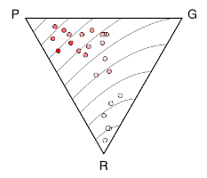

# TriFabPlot
MATLAB script for plotting triangular fabric plots from eigenvalues of orientation tensors of directional data based on algorithms presented in Vollmer (1989, 1990, 2020). Additional files include example data files. 

---

## Citation
This repostory contains MATLAB implementations of algorithms presented in:

__Vollmer, F.W., 2020. Representing progressive fabric paths on a 
  triangular plot using a fabric density index and crystal axes 
  eigenvector barycenters. Geological Society of America Abstracts with
  Programs. Vol 52, No. 6, doi: 10.1130/abs/2020AM-358862__
  
__Vollmer F.W., 1990. An application of eigenvalue methods to structural 
  domain analysis. Geological Society of America Bulletin, v. 102, n. 6,
  786?791, ISSN 00167606__
  
__Vollmer F.W., 1989. A triangular fabric plot with applications for 
  structural analysis. EOS Transactions American Geophysical Union 
  70:463__

One or more of these should be cited by publications using this code, algorithm, or derivative works, to produce figures or other content. 

## License
See [LICENSE](LICENSE.md) and [CITATION](CITATION.md) for license and citation information.

## Download
[TriFabPlot](https://github.com/vollmerf/trifabplot/releases/tag/v1.0.0)

## Related Software
The program [Orient](https://vollmerf.github.io/orient/) by this author is free software that includes this functionality, and numerous additional options. It runs on Macintosh, Windows, and Linux platforms.

--- 

[Home](https://vollmerf.github.io/) | [Software](https://vollmerf.github.io/software/) | [Orient](https://vollmerf.github.io/orient/) | [EllipseFit](https://vollmerf.github.io/ellipsefit/) | [Antevs](https://vollmerf.github.io/antevs/)

| 6 Aug 2020 |